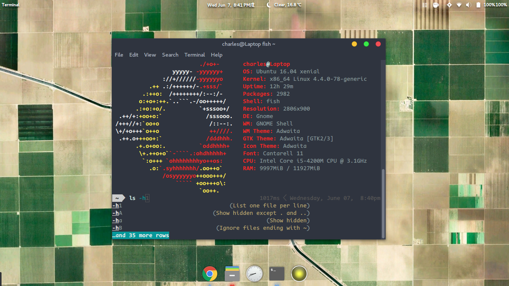
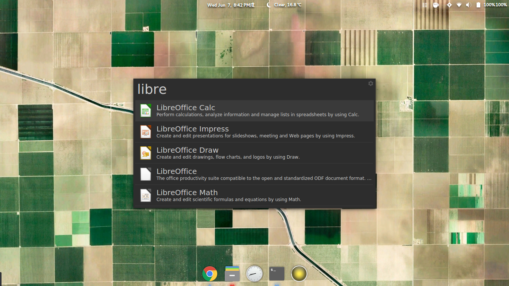
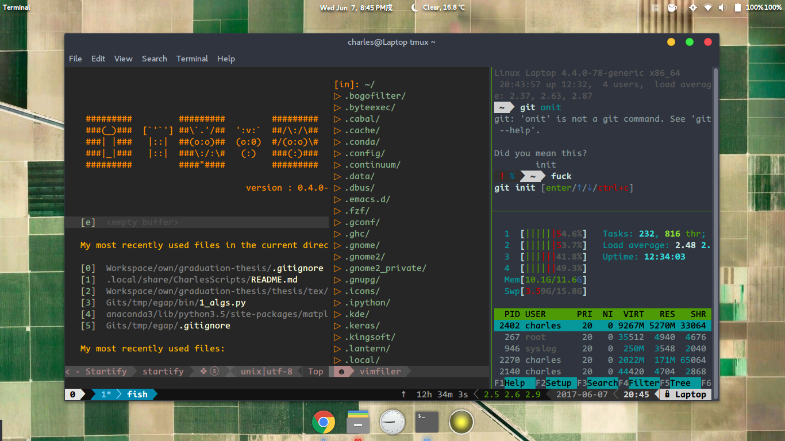

# CharlesScripts #

### 你为什么要安装本项目？ ###
- 自动安装配置**powerline**
- 使用`add-ppa`和`inst`命令安装软件的同时**备份软件和ppa列表**（建议**fork**本项目，**fork**后可以将备份的列表上传到自己的github。**电脑坏掉之后可以迅速安装好软件并恢复原样**）
- 使用`gnome-shell-extensions-backup`,`omf-backup`和`gnome-shell-extensions-restore`,`omf-restore`**备份、恢复gnome/omf插件**（同样建议**fork**本项目）

### 发布记录： ###

* version: r0.1: 该版本将之前所有的代码合并到一起，并将结构大改，大大方便了安装和使用。并没有安装程序，需要自己手动安装。文档还有待完善。

### 使用说明： ###

请配合我的博客：[**Ubuntu Gnome 酷炫完整指南系列**](https://the0demiurge.blogspot.jp/2017/02/ubuntu-gnome.html)（需翻墙，且hosts无效，可以先用[lantern](https://github.com/getlantern/lantern)翻出去再看）使用。

### 项目说明： ###

懒是人类进步的第一动力，经过几年Ubuntu的使用，我写了一些很方便的小脚本，但因为我是初学者，早期代码风格很糟糕。而且当时写这些脚本主要为了自己用，只追求functional...因为水平有限，我把它们开源出来请大家多多指教，共同完善：）

* 支持的操作系统：Ubuntu Gnome 最新LTS版（其他Linux发行版甚至WSL、Linux on Android等也能用，只不过部分功能需要hack一下脚本）。
* 读者须知：使用此脚本需要一定（较低）的英文和bash脚本阅读能力，由于本项目不够完善，有的脚本可能迁移到您的电脑之前需要小小地修改。
* 依赖项（需要用户自行安装）： Nerd Fonts, Google Chrome, git, espeak, cowsay, oneko, sl, fortune
* 可选项：Anaconda, ipython (>=5.0), fortune-zh

**内容简介：**

* 使用`add-ppa`功能可以备份 ppa 列表，使用`inst`命令可以备份安装文件列表。
* `charles/installation.d/`文件夹内的脚本可以自动化安装、配置、配置tmux、配置ipython、配置pdb，的powerline
* `update`命令更新源和软件，类似于`pacman -Syyu`
* 自动更新hosts实现无缝科学上网、自动备份系统信息。

**本项目建立目的：**

1. 贡献我写的小脚本给大家，方便使用
2. 请大家为这些小脚本提出建议、共同修改、共同完善
3. 帮助不会科学上网的同学更方便地查资料（Linux, Windows）
4. 如果大家或者我的电脑需要从头开始重装系统，可以大幅减少配置环境所需时间
5. 让大家感受Linux的美

**警告：除了本页面或我的博客推荐过的脚本，如果你没有读过我写的脚本的话请谨慎使用**

# 安装指南 #
**完整的安装程序还没做好，可以先把它完全下载下来然后有选择地逐个阅读并运行`~/.local/share/CharlesScripts/charles/installation.d`里面的安装脚本。**

1. 下载本项目：`git clone https://github.com/the0demiurge/CharlesScripts.git ~/.local/share/CharlesScripts`
2. `cd ~/.local/share/CharlesScripts/charles/installation.d`
3. 逐个阅读并运行安装脚本。

# 效果图： #



# 项目目录： #
目录更新日期：Mon Oct  9 16:31:59 CST 2017

24 directories, 57 files

CharlesScripts/
├── accessories
│   ├── arc-darker-theme for Google Chrome.crx
│   ├── cows.txt                                    # cowsay 所有动物的名称和图像
│   └── tux_cursors.tar.xz
├── charles
│   ├── bin
│   │   ├── add-ppa                                 # 可批量增加ppa，并备份ppa列表到~/.backup/ppa
│   │   ├── adduser                                 # 为系统增加用户，并记录何时、为谁添加的账户，比如adduser san 张三（管理服务器的时候方便）
│   │   ├── apt-unlock                              # apt-get异常终止之后可以用它来去掉lock文件
│   │   ├── ef                                      # 编辑fifo命令
│   │   ├── fifo                                    # 先入先出队列，用来暂时放一些准备一会再跑的脚本命令
│   │   ├── inst                                    # 安装软件并备份软件列表到$CHARLES_BACKUP
│   │   ├── note                                    # 提醒，用法为note <time> <to-do>,作用为在<time>之后提醒我做<to-do>,如 note 10m '回家' 为提醒我十分钟之后回家（需要输入sudo apt install espeak安装语音合成引擎）
│   │   ├── .aria2c.conf
│   │   ├── aria2c-daemon-start                     # 开启aria2c的服务，使用.aria2c.conf作为配置文件，文件自动下载到`~/Downloads`文件夹
│   │   ├── cb2pdf
│   │   ├── charles-backup                          # 自动备份 gnome-shell-extensions, oh-my-fish 插件到$CHARLES_BACKUP，备份sublime-text3的所有配置到$BACKUP_HOME/.config里面
│   │   ├── get-path                                # 获取某文件的路径，放到剪贴板。比如`get-path .local/share/CharlesScripts`
│   │   ├── gnome-shell-extensions-backup           # 备份gnome-shell插件（会被charles-backup调用）
│   │   ├── gnome-shell-extensions-restore          # 恢复之后需要手动到gnome-tweak中启用插件
│   │   ├── ipgw                                    # 东北大学校园网关登陆器
│   │   ├── macaddr-rand
│   │   ├── omf-backup                              # 备份oh-my-fish插件（会被charles-backup调用）
│   │   ├── omf-restore
│   │   ├── quit-qq                                 # 完全退出Longene TM2013版的TM.exe和wineserver
│   │   ├── update                                  # 类似于pacman -Syyu，自动更新所有软件，实际上就是 sudo apt update; sudo apt upgrade -y; sudo apt autoremove -y
│   │   ├── show_loving
│   │   ├── ssr                                     # ShadowSocksR 客户端一键安装配置和使用脚本（具体用法见脚本注释）
│   │   ├── tomato                                  # 蕃茄钟
│   │   ├── wallpaper-earthview                     # 自动抓取Google Earthview作为Gnome桌面壁纸（其他桌面也能用，需要调整里面修改壁纸的命令）
│   │   └── wechat                                  # 使用 google-chrome 打开网页版的微信
│   ├── installation.d
│   │   ├── conf.d
│   │   │   ├── config-bash
│   │   │   ├── config-fish
│   │   │   ├── config-git
│   │   │   ├── config-gnome
│   │   │   ├── config-powerline-bash
│   │   │   ├── config-powerline-ipython
│   │   │   ├── config-powerline-tmux
│   │   │   └── config-tmux
│   │   ├── get.d
│   │   │   ├── get-calibre
│   │   │   ├── get-docker
│   │   │   ├── get-fasd
│   │   │   ├── get-oh-my-fish
│   │   │   ├── get-powerline
│   │   │   ├── get-resilio_sync
│   │   │   ├── get-spacemacs
│   │   │   ├── get-spacevim
│   │   │   ├── get-sublime-text-3
│   │   │   ├── get-thefuck
│   │   │   └── get-xsh
│   │   ├── install.py                              # 安装我备份的所有软件，并进行配置的一键部署脚本(警告：这个还未完成，功能有bug)
│   │   ├── omf-backup -> ../bin/omf-backup
│   │   └── omf-restore -> ../bin/omf-restore
│   ├── install.sh                                  # 安装我备份的所有软件，并进行配置的一键部署脚本(警告：这个还未完成，功能有bug)
│   ├── packages.list.d                             # 该文件夹是安装本工具后自动设置的$CHARLES_BACKUP路径，现在想要修改$CHARLES_BACKUP还不是太容易，将在遥远的未来把配置挪到`~/.config`下面。里面是备份的软件列表等资料
│   │   ├── gnome-shell-extensions.zip
│   │   ├── omf.list
│   │   ├── ppa
│   │   └── ubuntu.list
│   └── shell.rc.d                                  # shell 初始化脚本，主要包括alias等，还包括许多实用函数，建议阅读一下
│       ├── init.fish
│       └── init.shell
├── data                                            # 对系统其他软件的配置
│   ├── home
│   │   ├── .cache
│   │   │   └── albert
│   │   │       ├── core.db
│   │   │       ├── org.albert.extension.files.txt
│   │   │       └── running
│   │   ├── .config                                 # 我的配置文件
│   │   │   ├── albert
│   │   │   │   └── org.albert.extension.websearch.json
│   │   │   ├── albert.conf
│   │   │   ├── fusuma
│   │   │   │   └── config.yml
│   │   │   └── sublime-text-3
│   │   │       └── Packages
│   │   └── .local
│   │       └── share
│   │           └── albert
│   │               ├── last_used_version
│   │               └── org.albert.extension.files.txt
│   ├── pac
│   ├── tampermonkey_backup.zip
│   └── ublock_origin                               # chrome中的AdBlock广告过滤里面的自定义部分
│       ├── my-ublock-backup.txt
│       └── my-ublock-static-filters.txt
├── figs
├── notebook
│   └── setup-gnome-extensions
├── README.md
└── tools
    ├── auto_hosts_updater                          # 自动更新hosts以供解除部分网页的使用限制，有windows和linux版。
    │   ├── linux
    │   │   ├── install.sh
    │   │   └── uninst.sh
    │   ├── README.md
    │   └── windows
    │       ├── install.bat
    │       ├── README.md
    │       └── uninst.bat
    ├── codecombine                                 # 将某个文件夹及子文件夹里面所有符合给定筛选条件的文本放到一个文件里，并进行字（行）数统计
    └── README.md

27 directories, 79 files


```
